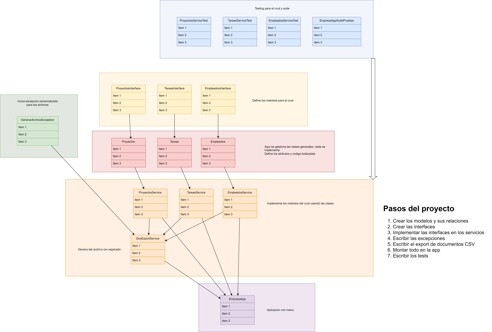
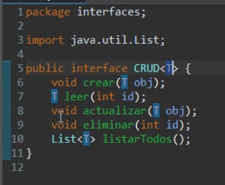
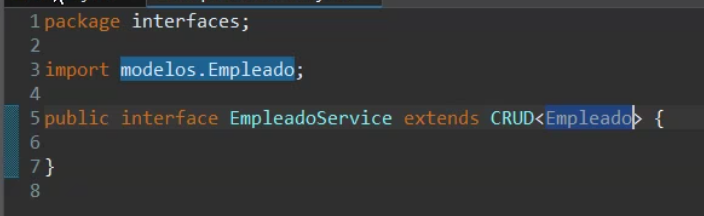
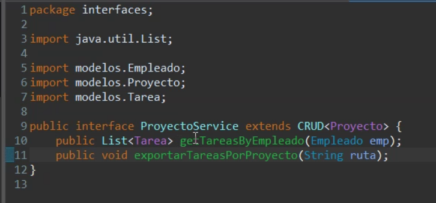
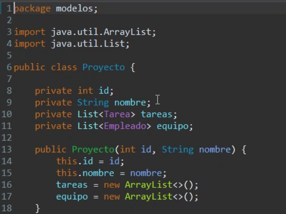
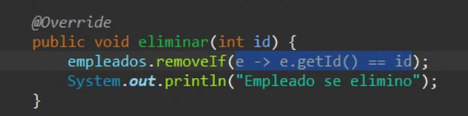
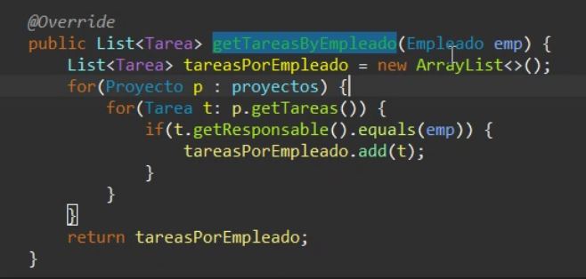
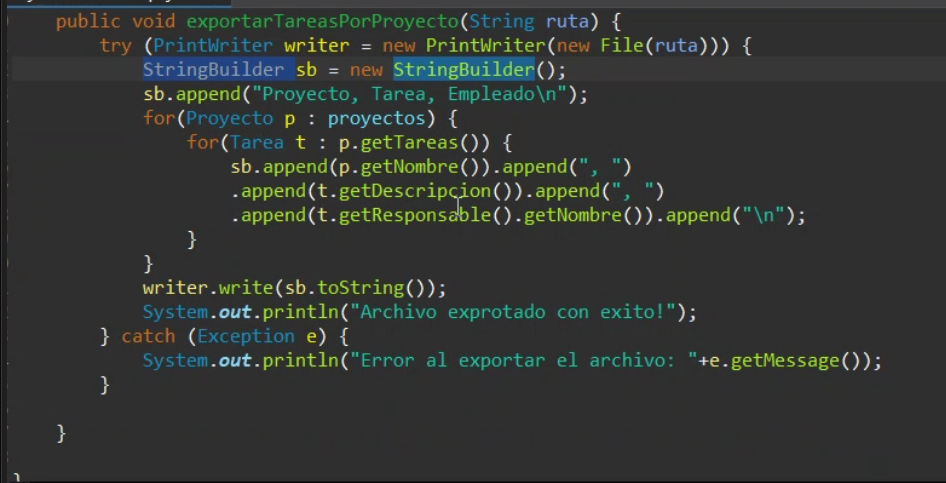

# Ejercicio 1 sesion 33 modulo 4

Diagrama de clases propuesto: (No incluye métodos)

> Limitado solo a la estructura general del proyecto

## Cosas hechas distintas por el profesor:

- Creacion de una interfaz generica llamada CRUD
- Se crear servicios de interfaz que extienden de CRUD
- En proyectos se hicieron 2 metodos de interfaz adicionales para satisfacer los requerimientos
- Se crean atributos en los modelos para unir las entidades
- El profesor usa `List` en lugar de `Map` pero ambas son validas

- Se prefirio un sistema de menu en forma de arbol donde se prueba de manera extensa el CRUD de cada entidad por separado. Es triggereado por una clase llamada `AppController` con un metodo llamado `iniciar`

### CAPTURAS DE DIFERENCIAS

Interfaz generica

Interfaz generica siendo cargada en cada interfaz especifica, la `T` sera reemplazada por el tipo de objeto correcto en cada caso, en este caso `Empleado`

Metodos extras solo para el caso particular de `Proyecto`, toma todos los metodos genericos, los carga para si mismo usando `extends` y añade los propios

Creacion de una lista de `Empleado` y una lista de `Tarea` para los proyectos

Se prefiere el uso de `Streams` y **Funciones Lambda** en vez de ciclos

Se usa un metodo para listar las tareas por empleado

Ejemplo de implementacion para escribir el archivo `CSV` requerido. Es un archivo regular de texto separado por comas al que se le ha dado una extensión

> Librerías específicas para CSV no son requeridas